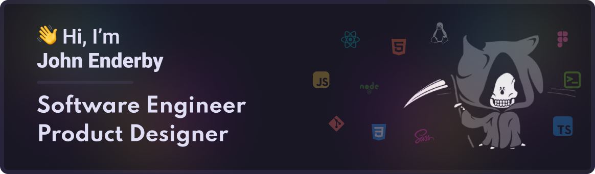

<!--
**johnend/johnend** is a ✨ _special_ ✨ repository because its `README.md` (this file) appears on your GitHub profile.
-->

I’m John, an Edinburgh-based software engineer and product designer. I spent around 10 years as a designer before making the move to engineering in 2021, and that background shapes everything I build — component libraries, design systems, CMS schemas, front end architecture. I care a lot about the gap between how something looks and how it’s built, and I’m lucky that my job lets me sit right in the middle of it.

I like to do as much as possible in the terminal these days and I daily drive NeoVim both personally and for work.

I’m a huge believer in open source software (check my [dotfiles](https://github.com/johnend/dots) 😉).

When I’m not tweaking configs you’ll find me going after new benchpress PRs in the gym, chasing birdies on the golf course, or raising two wonderful kids alongside my wife.

<!--
### Currently

What are you working on right now? A sentence or two here keeps the profile feeling alive.
-->

### Environment

### Tech Stack

#### Design

#### Front End

#### Infra

#### Other

### Learning

### 🚀 Featured

**[Dotfiles](https://github.com/johnend/dots)** — a terminal-first setup built around NeoVim and Tmux. If you live in the terminal there's probably something useful in here:

- Neovim config (Lua, lazy.nvim, `roseprime` colourscheme)
- Tmux with Catppuccin theming
- AeroSpace (macOS) and Sway (Linux) window manager configs
- Shell tooling: `lazygit`, `spotify-player`, Zsh, and more

My go-to colourschemes are Catppuccin and Rose Pine — usually a mix of both depending on what's supported. Take a look, and if anything's useful, make it your own.

### Unnecessary stats

