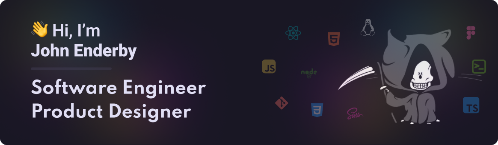

<!--
**johnend/johnend** is a ✨ _special_ ✨ repository because its `README.md` (this file) appears on your GitHub profile.
-->

I’m John, an Edinburgh-based software engineer and product designer. I was a designer for around 10 years and made the move to engineering in 2021. To be honest there should be more roles that cover both product design and front end engineering, but that's a topic for a blog post. I have built component libraries, contirbuted to front end projects, defined schemas for CMSs, and configured a Linux environment.

I like to do as much as possible in the terminal these days and I daily drive NeoVim both personally and for work.

I’m a huge believer in open source software (check my  😉).

When I’m not tweaking configs you’ll find me going after new benchpress PRs in the gym, chasing birdies on the golf course, or raising two wonderful kids alongside my wife.

### Environment

### Tech Stack

#### Design

#### Front End

#### Infra

#### Other

### Learning

### 🚀 Featured

Why are my dotfiles featured? Well there's a lot of going on there, and if you like a terminal based workflow there's almost certainly something you might find useful. I prefer to do as much as possible in the terminal, from playing music via `spotify-player` or managing my repos with `lazygit`.

My preferred colorschemes are Catppuccin and Rose Pine (usually a combination of both). I have a few others intalled for NeoVim but tend to stick with `roseprime` as it is a good contrast with Catppuccin when working in TMUX.

Take a look, and if there's anything useful in there for you, take it and make it your own.

### Unnecessary stats

